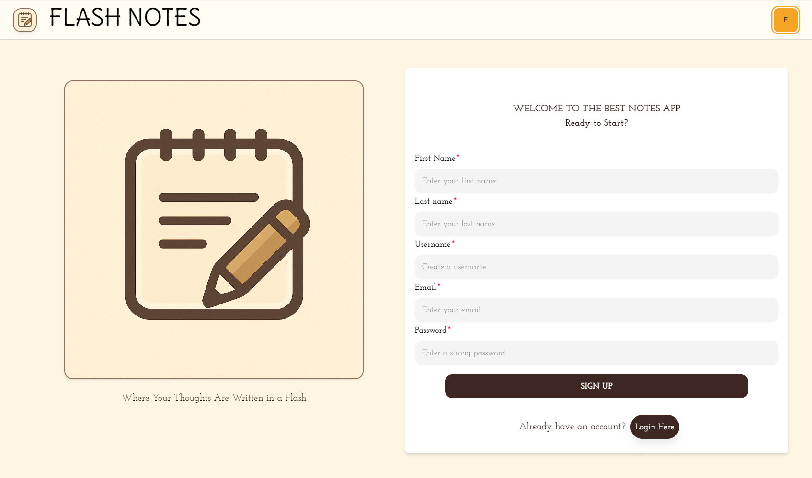
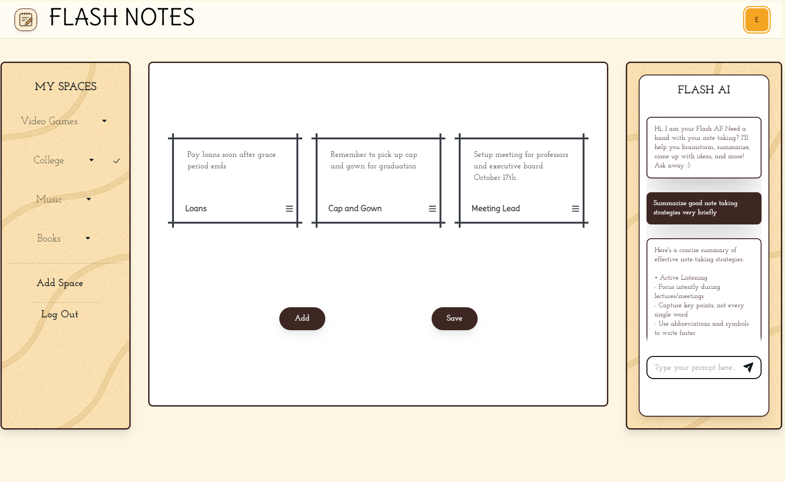
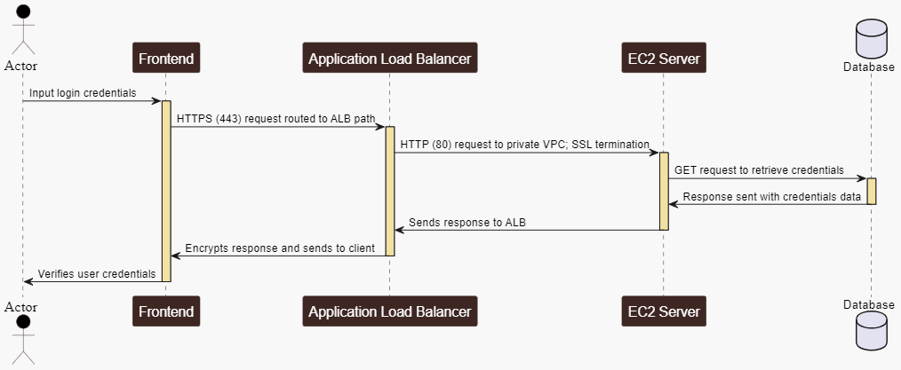

# NotesApp

## About

Flash Notes presents a quick and simple way to express thoughts in a flash. It makes creating notes fast for those
needing to get straight to the point. Create an account, log in, and you'll have the control to create spaces to add
as many notes as you want: shopping list, quick reminders, agendas, etc. You can even use the integrated AI assistant
to help brainstorm ideas or get insight on quality note taking. With Flash Notes, it's possible!

## Initial Setup

Install the latest version of Node.js here at [nodejs.org](https://nodejs.org/en/download/package-manager)!

## Front-End Application

### Frontend and Backend Interaction Sequence

### Starting the Server
1. Switch directory to notes-app-web
2. Run <b>npm i</b> to install needed packages/libraries.
3. Run <b>npm run dev</b> to start Next.js app
4. App should run on http://localhost:3000

### Tools/Resources Used for Frontend

<li>Amazon Web Services (AWS) to create a unique app domain (Route 53), host it for public use (Amplify), and connect to backend server (EC2) [aws.amazon.com](https://aws.amazon.com/console/)</li>
<li>Redux for centralizing state of variables globally across application; creates local store, variables, and reducers to change values of states [Redux.org](https://redux.js.org/)</li>
<li>HeroUI for dynamic and adaptable user components enhance developement and user experience [HeroUI.com](https://www.heroui.com/docs/frameworks/vite)</li>
<li>Font Awesome for supplying app with ready icons at [FontAwesome.com](https://fontawesome.com/icons)</li>

## Back-End

### Running the Server With Next.js Application
1. Change directory to /servers
2. Run <b>npm i</b> to install needed packages/libraries.
3. Change directory to /servers/mongodb
4. Execute command <b>node connect.js</b>
5. Console should log hosted URL: http://localhost:5000

### Tools/Resources Used for SSR (Server-Side Rendering)

<li>Amazon Web Services (AWS) to connect backend server on EC2 instance, respond to API requests, and handling elactic load balancing from HTTPS to HTTP [aws.amazon.com](https://aws.amazon.com/console/)</li>
<li>MongoDB to store information within database: credentials, notes, spaces, etc. [MongoDB.com](https://www.mongodb.com/)</li>
<li>Express.js to create and maintain server, develop and integrate APIs, and run code locally or external server [Express.js](https://expressjs.com/)</li>
<li>Anthropic for artifical intelligence nuance capabilities for notes chatbot implementation [console.anthropic.com](https://console.anthropic.com/)</li>

## Author

- Elijah Dodson

